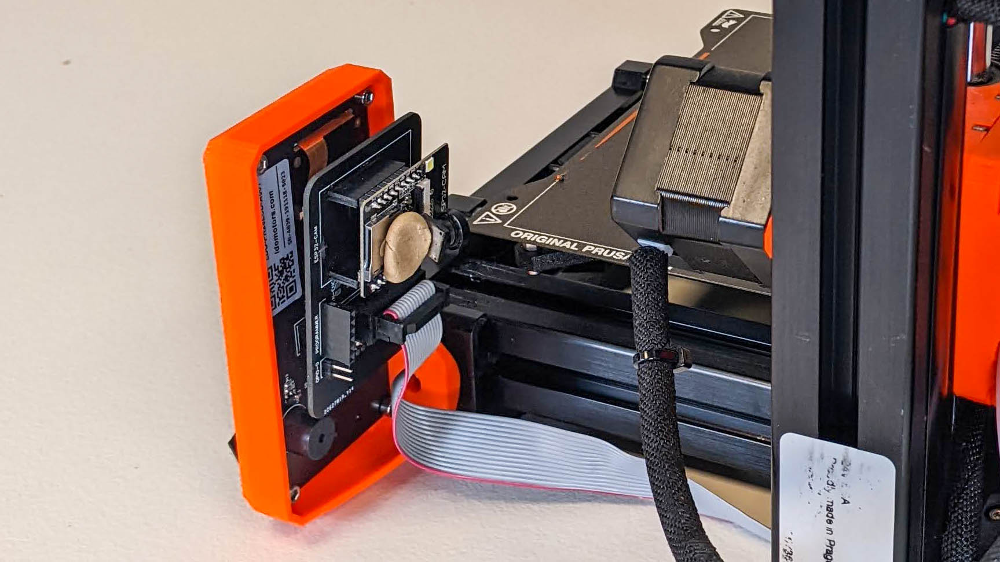

# PrintCam Hardware
Here is the repo for the hardware

With Prusa Connect now fully up and running, it is time to bring it to the next level! Let’s add a camera to check the printing progress.

Over the last years, I developed multiple cameras to check on the print progress of my mini. With Prusa Connect now fully developed, I went the extra mile to develop something that smoothly integrates into your personal Prusa Connect!

On initial configuration the Print Camera sets up its own wifi hotspot, this makes it easy for you to configure your wifi and Prusa Connect details.

I would love to give you the possibility to add a simple camera to your setup and make print spaghetti a thing of the past.

Details:
* 640×480 resolution (possible future upgrade to 600×800)
* image update once every 10 seconds (limitation Prusa Connect)
* 2.4GHz wifi only

Example Prusa connect view:

## Tower version

This version connects to the x-axis stepper and thus gives you a stable view of the nozzle. The module is powered by a connector that plugs in between the USB port and the USB drive.

The package requires:
- Wifi module
- 3D print
- 2 Cable ties
- Power cable

## Stealth version

This version connects to the back of the display module. the module is powered by the cable that goes to the display module. DISCLAIMER: The video feed of this is 90 degrees rotated, this is a permanent limitation

The packagage requires:
- Wifi module
- PCB
- Connectors

